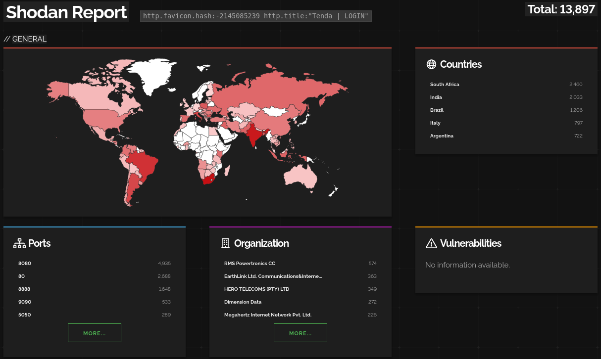
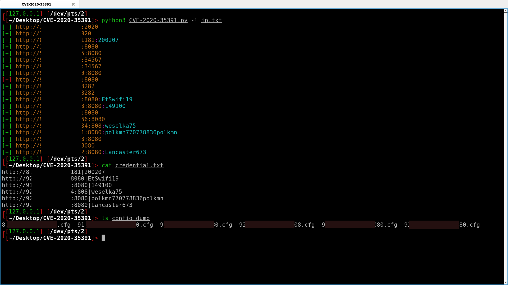

# CVE-2020-35391
Tenda f3 Malformed HTTP Request Header Processing Vulnerability.

## Run
```
python3 CVE-2020-35391.py --help
python3 CVE-2020-35391.py
python3 CVE-2020-35391.py -i http://127.0.0.1:8080
python3 CVE-2020-35391.py -l ip.txt
```

## Tenda F3

## Shodan Dork

## Exploitation

